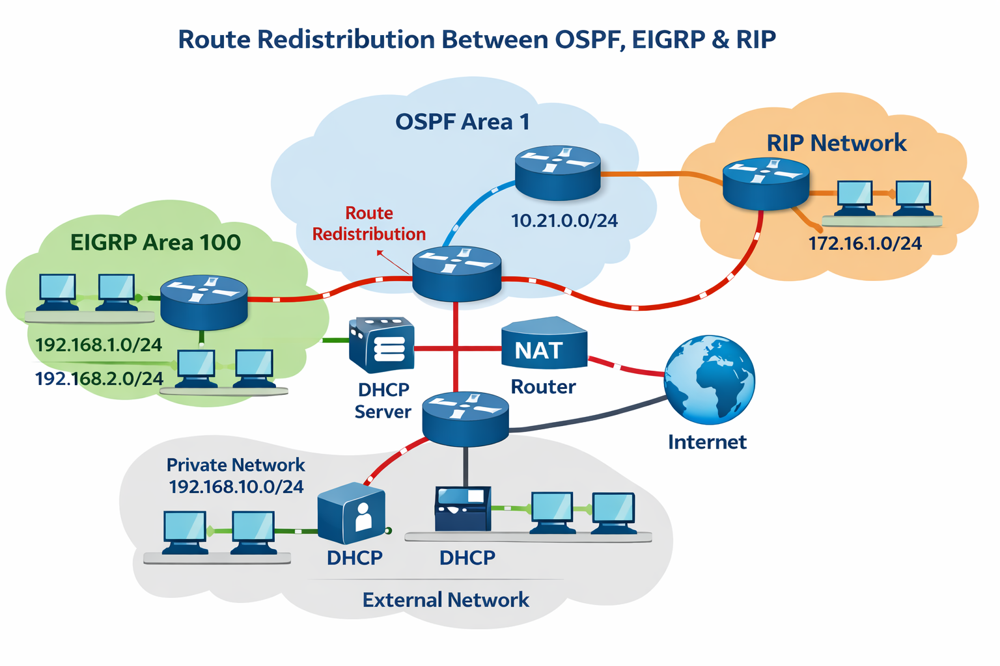

# Route Redistribution Lab (EIGRP, OSPF & RIP) with NAT & ACL

This repository contains a **Cisco Packet Tracer** lab and supporting documentation that demonstrate how to design and configure a multi‑protocol network.  It combines variable‑length subnetting (VLSM), multiple interior gateway protocols (EIGRP, OSPF and RIP), route redistribution, Dynamic Host Configuration Protocol (DHCP), Network Address Translation (NAT) and access‑list filtering.  The provided Packet Tracer file (`Redistribution.pkt`) can be opened in Cisco Packet Tracer to practise the configuration.  The documentation below summarises the design, explains the underlying theory and gives high‑level steps for configuring the routers and services.

## Why route redistribution?

In homogeneous networks a single routing protocol advertises all reachable networks.  Real‑world enterprise networks often run more than one protocol; for example, a company using **OSPF** might acquire another network that runs **EIGRP** or **RIP**.  These protocols use different metrics and are not compatible with each other, so connectivity cannot be achieved without exchanging routes between them.  **Redistribution** is the process of injecting routing information learned from one routing protocol into another.  NetworkLessons notes that many networks run a single protocol, but “we have multiple routing protocols on our network and we’ll need some method to exchange routing information between the different protocols”【938004238182037†L81-L89】.  It also points out that redistribution can cause loops and requires attention to metrics【938004238182037†L90-L97】.

## Topology overview

The lab is divided into blocks representing different routing domains.  Each block uses a different protocol or area, and the routers that interconnect them perform redistribution.  A high‑level view of the network is illustrated below (see **images/network_diagram.png**):



* **EIGRP block (AS 11)** – the left portion of the network runs Enhanced Interior Gateway Routing Protocol.  Several subnets and PCs are connected.  Hosts obtain IP addresses via a DHCP server.
* **OSPF Area 1** – the central block uses OSPF area 1.  It contains user networks and servers.  A router in this area redistributes routes into EIGRP and RIP.
* **RIP block** – the right portion runs RIP v2.  Routes learnt via RIP are redistributed into OSPF area 1 and vice versa.
* **OSPF Area 2** – a second OSPF area sits south of the network.  Area 1 and area 2 are connected by a router performing OSPF‑to‑OSPF area redistribution (external LSA).  Hosts in area 2 also obtain addresses via DHCP.
* **NAT Router (Router 10)** – to provide internet connectivity, a dedicated router performs NAT.  NAT translates private inside addresses to a public IP address so that multiple internal hosts can share a single public address.  GeeksforGeeks notes that NAT allows devices in a private network to access the Internet using a single public address, helping conserve IPv4 space and hiding internal systems【420388550238901†L27-L34】.  The NAT router also runs DHCP for the area 2 hosts.
* **ACL restrictions** – specific hosts are denied access to particular servers.  For example, one PC in network L must be blocked from reaching the web server, one PC in network E must be blocked from the data server, and all hosts in network A must be blocked from the TFTP server.  Access lists operate per interface and per direction; each interface can have one ACL applied inbound and one outbound【971294360107175†L111-L125】.

## Variable‑length subnetting (VLSM)

The lab uses **variable‑length subnet masks** to allocate IP address space efficiently.  Instead of assigning every subnet a fixed size, the network is broken into subnets sized according to the number of hosts required.  GeeksforGeeks explains that VLSM allows administrators to apply multiple subnet masks within the same network, allocating different sizes based on host requirements【449795872524349†L27-L34】.  This flexibility minimizes address wastage compared with fixed‑length masks.  When implementing VLSM:

1. Determine the number of hosts needed for each subnet and include space for network and broadcast addresses.
2. Sort the subnets by size (largest first)【449795872524349†L79-L97】.
3. Assign the largest block first and continue assigning consecutive address space to the remaining networks【449795872524349†L104-L128】.

In the provided lab, networks in the first row have different host requirements.  Networks connected to routers 5–9 are not labelled; you may choose any appropriate size from your VLSM tree.  Classless routing protocols such as OSPF, EIGRP and RIP v2 support VLSM.

## Routing protocols and redistribution

### EIGRP

Configure EIGRP on the routers in the first block (AS 11).  Advertise each connected network using the `network` command and disable automatic summarization if required:

```bash
R1(config)# router eigrp 11
R1(config-router)# no auto-summary
R1(config-router)# network <your subnet>
```

### OSPF

Routers in the central block run OSPF area 1.  Use the `router ospf` command to start the process and specify the networks and wildcard masks.  OSPF forms adjacencies on matching interfaces and calculates link‑state cost as its metric.  A second OSPF area (area 2) is attached via router 4.  The `area` parameter assigns each network to the appropriate area.  Redistribution between area 1 and area 2 occurs automatically because both are OSPF; the router summarises routes as Type 3 LSAs.

### RIP

The right block uses RIP v2.  Enable version 2 to support classless routing and disable auto summarisation.  Advertise the networks connected to RIP routers.  RIP uses hop count as its metric.  A maximum of 15 hops are reachable; routes with a metric of 16 are considered unreachable.

### Route redistribution

Routers connecting different routing domains perform redistribution.  According to NetworkLessons, redistribution imports routes from one protocol into another and requires a *seed metric* because each protocol uses a different metric【938004238182037†L90-L93】.  The default seed metrics for RIP and EIGRP are infinite, so you must specify appropriate metrics manually【938004238182037†L197-L217】.  A general approach is:

```bash
R2(config)# router ospf 1
R2(config-router)# redistribute eigrp 11 metric 20 subnets

R2(config)# router eigrp 11
R2(config-router)# redistribute ospf 1 metric 10000 10 255 1 1500

R2(config)# router rip
R2(config-router)# redistribute ospf 1 metric 2
```

The example above redistributes between OSPF, EIGRP and RIP.  Always ensure the redistributed routes exist in the local routing table and tune metrics to avoid sub‑optimal routing.  Use route maps to filter or modify redistributed routes.  Be careful to prevent routing loops; route tagging and administrative distance adjustments can help.

## Network Address Translation (NAT)

Router 10 connects the internal network to the Internet and performs NAT.  NAT translates private inside addresses into a public IP address, allowing multiple devices to share a single public address and increasing security by hiding internal hosts【420388550238901†L27-L34】.  A typical NAT configuration on Cisco IOS includes:

```bash
R10(config)# interface GigabitEthernet0/0
R10(config-if)# ip address <public_ip> <mask>
R10(config-if)# ip nat outside

R10(config)# interface GigabitEthernet0/1
R10(config-if)# ip address <inside_ip> <mask>
R10(config-if)# ip nat inside

R10(config)# access-list 1 permit <inside_subnet> <wildcard>
R10(config)# ip nat inside source list 1 interface GigabitEthernet0/0 overload
```

This example uses **PAT** (port address translation) to translate multiple inside hosts using one public IP.  Adjust the access list to match the internal subnets.  Router 10 can also host DHCP pools for the internal networks.

## Access control lists (ACLs)

Access lists enforce security policies by filtering traffic entering or leaving an interface.  They operate per interface and per direction—each interface can have one ACL inbound and one outbound【971294360107175†L111-L125】.  For example, to block a specific host in network L from reaching the web server while permitting other traffic, create an extended ACL that matches the host and destination, apply it in the outbound direction on the router interface facing the server, and follow it with a permit statement for other traffic:

```bash
R3(config)# ip access-list extended BLOCK_WEB
R3(config-ext-nacl)# deny ip host 192.168.X.Y host <web_server_ip>
R3(config-ext-nacl)# permit ip any any
R3(config)# interface GigabitEthernet0/1
R3(config-if)# ip access-group BLOCK_WEB out
```

Replace `192.168.X.Y` with the PC’s IP address and `<web_server_ip>` with the server’s address.  Similar ACLs can be applied to block access to the data server and TFTP server.  Test ACLs carefully—misplaced denies can accidentally block legitimate traffic.

## DHCP servers

Two DHCP servers are present in the topology: one in the EIGRP/OSPF area 1 block (DHCP 1) and one in the OSPF area 2 block.  Each DHCP server provides IP addresses, default gateways and DNS settings for its respective hosts.  On Cisco IOS routers, configure a DHCP pool using `ip dhcp pool`, define the network and default router, and exclude addresses reserved for static devices.

## Repository structure

```
redistribution_repo/
├── README.md            ← This documentation
├── Redistribution.pkt    ← Packet Tracer file for the lab
└── images/
    ├── network_diagram.png  ← High‑level topology diagram
    ├── github_page.png      ← Sample GitHub page layout (screenshot)
    └── cli_screenshot.png   ← Example CLI configuration screenshot
```

The **Packet Tracer** file can be opened with Cisco Packet Tracer (version 7.0 or later).  Follow the documentation above to configure each router and verify connectivity.  The images help visualise the topology and illustrate how the final repository page looks.

## Further reading

* **Route redistribution** – A detailed explanation of why redistribution is needed, associated challenges and configuration examples【938004238182037†L81-L104】.
* **Variable‑length subnet masks (VLSM)** – An introduction to VLSM and examples of efficient address allocation【449795872524349†L27-L68】.
* **Network Address Translation (NAT)** – How NAT conserves IPv4 space and allows multiple devices to share one public IP【420388550238901†L27-L34】.
* **Access control lists (ACLs)** – Understanding how ACLs apply per interface and per direction and best practices for placement【971294360107175†L111-L125】.
